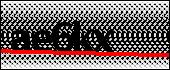
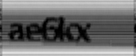
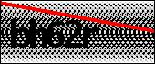
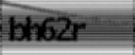

# Бенчмарк OCR для изображений с артефактами

[English version](README_EN.md)

Репозиторий фиксирует результаты экспериментов по распознаванию коротких 5-символьных строк на изображениях с сильными визуальными артефактами: шумным повторяющимся фоном, красной диагональной линией, низким контрастом и близко стоящими символами.

Задача рассматривалась как легитимное OCR-распознавание обычных изображений с артефактами. Название `captcha` используется только потому, что изображения визуально похожи на капчи.

## Датасет

- Использовано 32 примера с ручной разметкой.
- Каждая целевая строка состоит ровно из 5 символов.
- Алфавит: строчные латинские буквы и цифры.
- Полный датасет в репозиторий не добавлен; ниже оставлены несколько иллюстративных примеров.

## Примеры изображений

| ID | Оригинал | `box_k5_soft_contrast` |
|---|---|---|
| 001 |  |  |
| 009 |  |  |

## Лучший результат

Лучший практически полезный результат получился у OpenAI Vision на варианте подготовки `box_k5_soft_contrast`.

| Распознаватель | Подготовка | Точные совпадения | Exact rate | Avg char accuracy |
|---|---:|---:|---:|---:|
| OpenAI Vision | `box_k5_soft_contrast` | 13 / 32 | 40.6% | 73.1% |
| OpenAI Vision | `original + box_k5_soft_contrast` | 13 / 32 | 40.6% | 73.8% |
| OpenAI Vision | 4-image composite | 12 / 32 | 37.5% | 77.3% |
| EasyOCR | `box_k5_soft_contrast` | 0 / 32 | 0.0% | 38.5% |

Вывод: **OpenAI Vision + `box_k5_soft_contrast` оказался самым стабильным вариантом**, примерно на уровне **40-50% точного распознавания** в зависимости от формата запроса и запуска. Композит из нескольких вариантов улучшал среднюю посимвольную близость, но не улучшал число полностью правильных ответов.

## Что пробовалось в подготовке изображений

Основные группы экспериментов:

- оригинал без обработки;
- grayscale + 2x upscale;
- sharpening;
- color 2x upscale;
- low-pass / light blur для мягкого подавления фонового паттерна;
- FFT / notch-подавление повторяющегося паттерна;
- template residual / background suppression;
- удаление красной линии через маску и геометрию;
- морфология close/open;
- попытки построить маску текста;
- усиление тёмного текста;
- Real-ESRGAN upscale;
- Clarity upscaler.

Лучшим визуально и по итоговым метрикам оказался вариант:

`box_k5_soft_contrast`

Он не пытается полностью удалить фон. Вместо этого фон мягко подавляется, а символы остаются достаточно целыми. Более агрессивные варианты часто портили форму букв и цифр.

## Какие OCR/vision-модели пробовались

| OCR / Vision system | Результат |
|---|---|
| EasyOCR | Слабый результат на этом наборе; часто ошибался на цифрах и буквах из-за фонового паттерна. |
| Tesseract | На чистом sanity-check цифры распознавал, но на изображениях с артефактами работал плохо. |
| CapMonster | Полноценно не оценивался: на этом этапе не хватало пригодных логов/API-доступа. |
| OpenAI Vision | Лучший результат: около 40.6% точного совпадения на 32 примерах. |
| DeepSeek-OCR-2 | Локально запустился, но модель ориентирована на document/layout OCR; часто галлюцинировала или писала, что текста нет. |
| Chandra OCR 2 | Локально запустился после уменьшения масштаба входа; иногда угадывал начало строки, но точность была низкой. |
| Real-ESRGAN / Clarity upscalers | Не подошли: генеративное улучшение может менять сами символы. |
